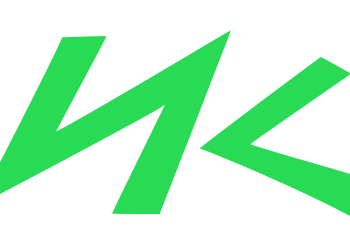

# NepKeys

<!-- PROJECT SHIELDS -->
<!--
*** I'm using markdown "reference style" links for readability.
*** Reference links are enclosed in brackets [ ] instead of parentheses ( ).
*** See the bottom of this document for the declaration of the reference variables
*** for contributors-url, forks-url, etc. This is an optional, concise syntax you may use.
*** https://www.markdownguide.org/basic-syntax/#reference-style-links
-->
![NodeJS][nodejs]
![Next JS][nextjs]
![Chart.js][chartjs]
![HTML5][html5]

 

  

  ## Nepkeys

  

    SEOptimized Typing Practice website to practice and increase your typing speed.
     
     
    <a href="https://nepkeys.netlify.app.">Website</a>
    ·
    <a href="https://github.com/PMP56/NepKeys/issues">Report Bug</a>
    ·
    <a href="https://github.com/PMP56/NepKeys/issues">Request Feature</a>
    

SEOptimized Nepali Typing Practice tool online to practice and increase your typing speed - built with NextJS. You can switch between different languages (Nepali, English, Newari, Hindi and Russian). 
Inbuilt timer to calculate wpm, accuracy and graph to show your progress all along.

## Running site at:
https://nepkeys.netlify.app/

## Semrush website ranking for following keywords

| Keywords                           | Website Ranking |
| ---------------------------------- |:---------------:| 
| newari typing practice             | 1/2             |
| newari typing online               | 9/10            | 
| nepali typing practice online      | 13              | 
| nepali typing tutor online         | 16              | 
| nepali typing practice             | 16/17           | 

*These datas are as of Nov 1 - Dec 1, 2021 and might change for you according to when you view and where you live*. 

[nodejs]: https://img.shields.io/badge/node.js-6DA55F?style=for-the-badge&logo=node.js&logoColor=white
[nextjs]: https://img.shields.io/badge/Next-black?style=for-the-badge&logo=next.js&logoColor=white
[chartjs]: https://img.shields.io/badge/chart.js-F5788D.svg?style=for-the-badge&logo=chart.js&logoColor=white
[html5]: https://img.shields.io/badge/html5-%23E34F26.svg?style=for-the-badge&logo=html5&logoColor=white